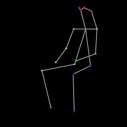

# Funny Experiment on Openpose

This repository showcases the robustness of Openpose 2D human pose estimator against limb occlusions. Adding 20*16 rectangle mask at center of both thighs only reduce the detection rate by 0.105.

### Description

Run the script `pose_estimator_test.py` and sees everything for yourself.

The required pose-estimator model file can be downloaded at [here](https://yadi.sk/d/blgmGpDi3PjXvK)

### Prerequsites
```
tqdm
keras (or tf.keras)
numpy
skimage
h5py
```

### Some Images
Here is an example of successful attack, the pose estimator failed to detect left knee and left foot.


Here is an example of failed attack, the pose estimator failed to detect right foot in the original image, but after the attack, it managed to recover the missing foot, how weird.





### Misdetection Results

Use pure rectangles to "amputate" limbs from half:
| Amputation Type  | Misdetection Rate |
| :---: | :---: |
| Both thighs | 0.105 |
| Both shins | 0.105 |
| Both arms | 0.135 |
| All limbs | 0.180 |

### TODO
- [x] Add some images
- [x] Add results for other datasets and amputation types
